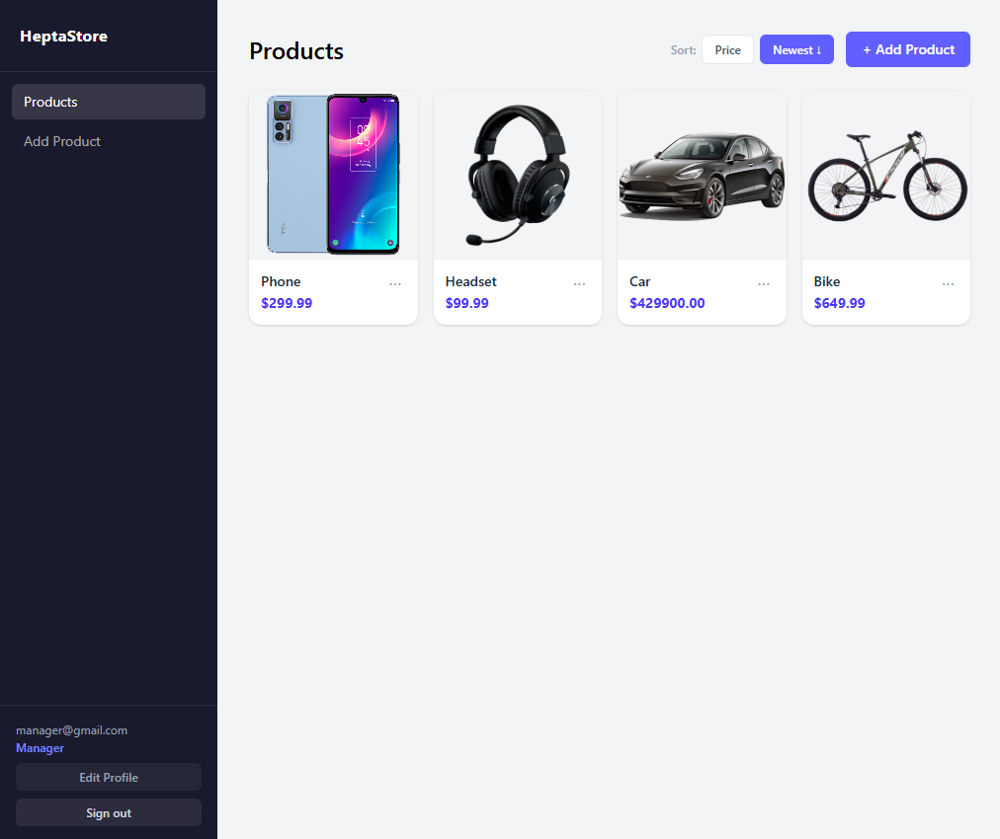

# HeptaStore

A product management REST API with a React frontend. Supports creating, listing, updating, and deleting products, including image uploads.



## Technologies

**Backend**
- .NET 10 / ASP.NET Core
- Entity Framework Core with SQL Server
- OpenAPI (built-in .NET 10)

**Frontend**
- React 19 + TypeScript
- Vite

**Infrastructure**
- Docker + Docker Compose
- SQL Server 2022

## Running in development

### Prerequisites

- [.NET 10 SDK](https://dotnet.microsoft.com/download)
- [Node.js 22+](https://nodejs.org/)
- SQL Server running locally on port `1433` (or via Docker — see below)

### 1. Start the database

```bash
docker compose up sqlserver -d
```

### 2. Start the backend

```bash
dotnet run --launch-profile http
```

The API will be available at `http://localhost:5229`.  
EF Core migrations run automatically on startup.

### 3. Start the frontend

```bash
cd ClientApp
npm install   # first time only
npm run dev
```

The app will be available at `http://localhost:5173`.  
API requests are proxied to the backend automatically.

## Running with Docker Compose

Builds and starts the full stack (SQL Server + backend + frontend served by ASP.NET Core):

```bash
docker compose up --build
```

The app will be available at `http://localhost:8080`.

To stop:

```bash
docker compose down
```

To stop and remove all data volumes:

```bash
docker compose down -v
```

## API endpoints

| Method | Path | Description |
|--------|------|-------------|
| `GET` | `/products` | List all products |
| `POST` | `/products` | Create a product |
| `GET` | `/products/{id}` | Get a product by ID |
| `PUT` | `/products/{id}` | Update a product |
| `DELETE` | `/products/{id}` | Delete a product |
| `POST` | `/products/upload` | Upload a product image |
| `GET` | `/products/{id}/image` | Download a product image |
